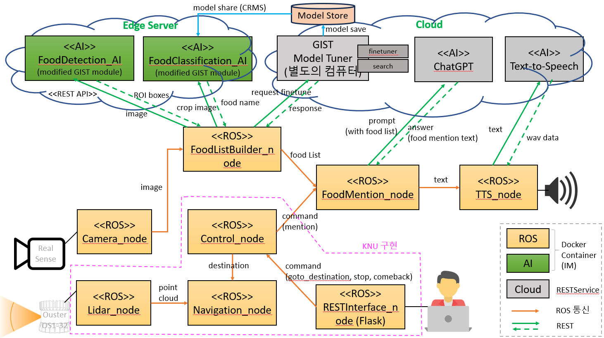
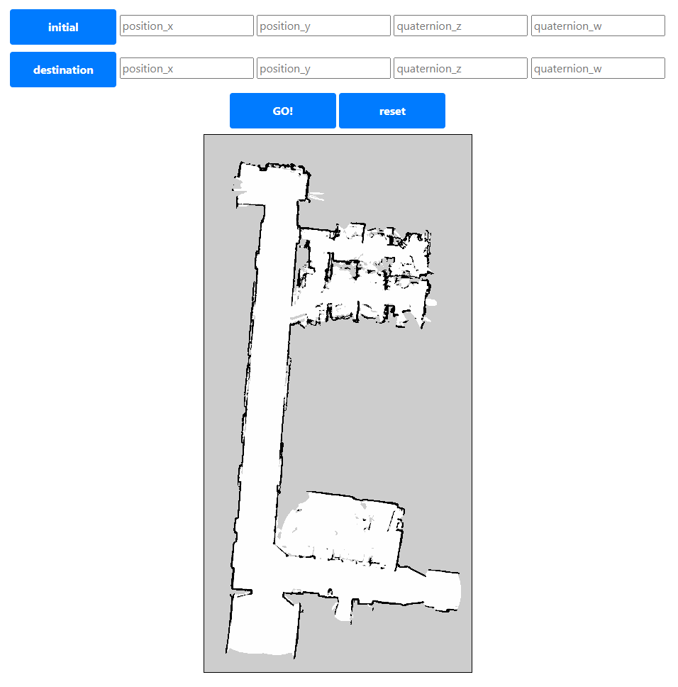
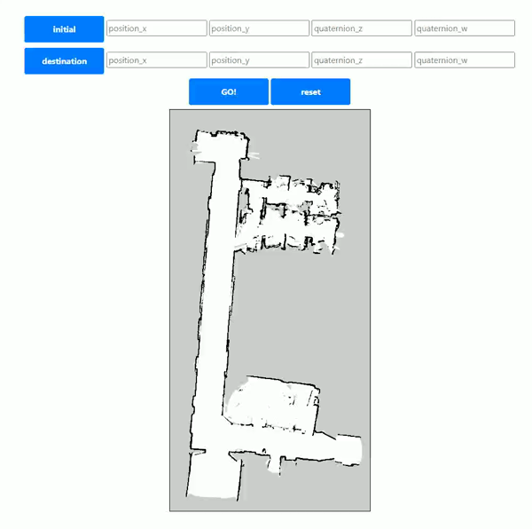

# ETRI_Demo

### ETRI Demo command

```bash
# Terminal 1 (LiDAR Node)
docker run -it --network=host --rm --privileged -v /dev/shm:/dev/shm asia-northeast1-docker.pkg.dev/lg-robot-dev/lg-ai-registry/iiclab/ouster_lidar

# Terminal 2 (Interface Node)
docker run -it --network=host --rm --privileged -v /dev/shm:/dev/shm asia-northeast1-docker.pkg.dev/lg-robot-dev/lg-ai-registry/iiclab/interface_node

# Terminal 3 (Control Node)
docker run -it --network=host --privileged -v /dev/jackal:/dev/jackal --rm asia-northeast1-docker.pkg.dev/lg-robot-dev/lg-ai-registry/iiclab/control_node

# Terminal 4 (Navigation Node)
docker run -it --network=host --rm --privileged -v /dev/shm:/dev/shm asia-northeast1-docker.pkg.dev/lg-robot-dev/lg-ai-registry/iiclab/navigation_node

# Terminal 5 (Jackal Bringup Node)
docker run -it --network=host --privileged --rm -v /dev/shm:/dev/shm -v /dev/jackal:/dev/jackal asia-northeast1-docker.pkg.dev/lg-robot-dev/lg-ai-registry/iiclab/jackal_bringup
```



# LiDAR Node

Please visit https://github.com/ans2568/ROS2_nodes/tree/main/jackal

# Navigation Interfaces

**This package serves custom srv interfaces.**

```
# Odom.srv
geometry_msgs/PoseStamped departure
geometry_msgs/PoseStamped destination
bool init
---
string result
```
```
# CurrentPose.srv
std_msgs/Empty data
---
geometry_msgs/PoseStamped current_pose
```

# Interface Node

**This node allows users to display the map required for Navigation and utilize the '2D Pose Estimate' and '2D Goal Pose' commands in Rviz2 by using Python Flask.**

> **_NOTE:_** Interface Node needs map.yaml, map.pgm. If you don't have them, Please make map from SLAM(Simultaneous Localization and Mapping).

> **_NOTE:_** Before using this node, if you have custom map, please overwrite custom map(yaml, pgm file) with the map.yaml and map.pgm paths.





### How To Usage

#### Build

```bash
# local build

git clone https://github.com/ans2568/ETRI_Demo.git

cd ETRI_Demo/

colcon build --packages-select navigation_interfaces interface_node

. install/setup.bash

ros2 run interface_node interface_node

# visit http://localhost:3306
```

```bash
# make docker image

git clone https://github.com/ans2568/ETRI_Demo.git

cd ETRI_Demo/

docker build -t interface_node -f interface_node/interface_node.dockerfile .

docker run -it -p 3306:3306 interface_node

# visit http://localhost:3306
```

#### UI Explanation

initial : mouse drag and drop in image after click initial button
- set Initial Pose

destination : mouse drag and drop in image after click destination button
- set Goal Pose

GO! : click GO! button
- request navigation service

reset : click reset button
- reset UI

### ROS2 client

/initialization : Get departure and destination information from RESTInterfaceNode
- Odom


# Control Node

**This node serves as a central role, receiving commands from RESTInterface_node and issuing commands to Navigation_node. Upon reaching the destination, it instructs FoodMention_node.**

### ROS2 service

/initialization : Get departure and destination information from RESTInterfaceNode
- Odom

### ROS2 client

/navigation_service : Send departure and destination information to NavigationNode
- Odom

### ROS2 publisher

/destination_arrived : Send Food Mention topic to Food Mention Node
- String : std_msgs/msg

# Navigation Node

**Navigation Node using Ouster OS1-32 3D LiDAR**

> **_Note:_** This node is designed to run ROS2 foxy version.

> **_Note:_** This node is designed to run exclusively within a Docker container.

> **_Note:_** If you wish to build and use it locally, please consider using it alongside the [navigation2](https://github.com/ros-planning/navigation2) package.

### How To Usage

```bash
# make docker image

git clone https://github.com/ans2568/ETRI_Demo.git

cd ETRI_Demo/

docker build -t navigation_node -f navigation_node.dockerfile .

docker run -it --rm --network=host --privileged navigation_node
```

### ROS2 service

/navigation_service : Navigate to destination after recieving departure and destination information from ControlNode.
- Odom